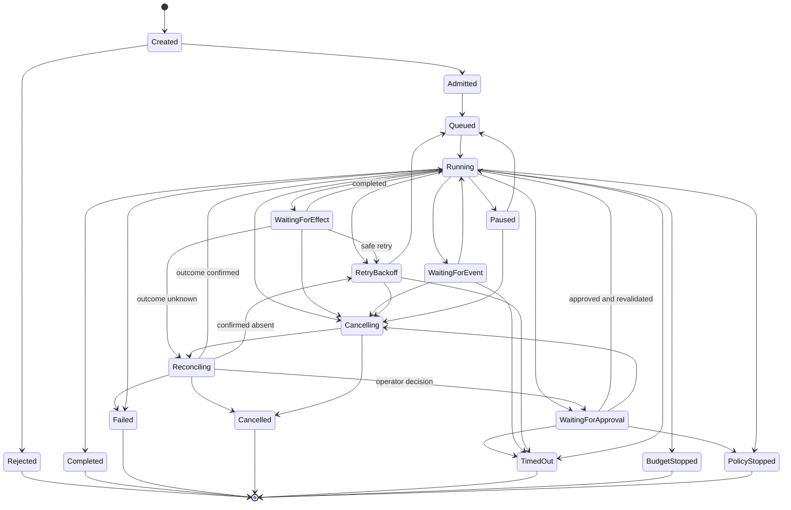

# Runtime and kernel

> **Status: Normative for ARA Durable and higher profiles**

## Canonical components

```text
Execution Kernel
+ Runtime Service
+ DurableExecutionPort and adapter
+ State Store
+ Platform Run Journal
+ Effect Ledger
+ Scheduler
+ Runtime Workers and WorkerLeases
+ Policy/Budget/Approval Gate
+ Model, Tool, Memory, Artifact, Human, and Sandbox Gateways
```

## Ownership

| Component | Owns | MUST NOT own |
|---|---|---|
| **Execution Kernel** | Pure legal state evolution, dependency resolution, completion, execution intents | Workers, SDKs, queues, secrets, provider clients |
| **Runtime Service** | Admission, coordination, scheduling, cancellation, streaming, recovery | Business-domain truth or authoring lifecycle |
| **Scheduler** | Runnable-work ordering, capacity, fairness, placement | Workflow semantics |
| **Runtime Worker** | Bounded execution of assigned activities/effects | Authoritative in-memory state |
| **WorkerLease** | Temporary ownership and fencing | Logical retry semantics |
| **Durable execution adapter** | Timers, signals, suspension, backend recovery | Public ARA domain model |
| **Platform Run Journal** | Canonical execution facts and stable public run semantics | Token-level streams and provider internals |
| **Effect Ledger** | Effect identity, invocations, idempotency, ambiguous outcomes, reconciliation | Business completion decisions |

The canonical journal is platform-owned. An application or product supplies domain events through contracts but does not own the platform execution schema.

## Execution kernel contract

```typescript
interface ExecutionKernel {
  evolve(state: RunState, event: RunEvent): RunState;
  decide(
    state: RunState,
    workflow: WorkflowVersion,
    deployment: DeploymentSnapshot
  ): readonly ExecutionIntent[];
}
```

For a fixed state, definition, deployment, and event sequence, `evolve` **MUST** return the same state.

`ExecutionIntent` includes scheduling an activity, requesting an effect, waiting, starting a child run, checkpointing, completing, or failing. It is not limited to model/tool effects.

## Durable execution boundary

```typescript
interface DurableExecutionPort {
  start(ctx: ExecutionContext, runId: RunId, deployment: DeploymentSnapshotRef): Promise<Result<DurableExecutionRef>>;
  signal(ctx: ExecutionContext, execution: DurableExecutionRef, signal: RuntimeSignal, idempotencyKey: string): Promise<Result<void>>;
  cancel(ctx: ExecutionContext, execution: DurableExecutionRef, reason: string): Promise<Result<void>>;
  query(ctx: ExecutionContext, execution: DurableExecutionRef): Promise<Result<DurableExecutionStatus>>;
}
```

Adapters may use Temporal, a database scheduler, an actor/event-sourced backend, or another durable mechanism. Backend-native history does not replace the platform journal.

## Run state machine



A deployment may expose more detailed projection states such as `waiting_for_model` or `waiting_for_tool`, but the normative state machine groups them under `WaitingForEffect`.

## Effect lifecycle

```text
proposal
-> schema and semantic validation
-> policy decision
-> budget reservation
-> approval when required
-> effect.planned committed
-> zero or more invocations
-> effect result, failure, or unknown outcome
-> usage reconciliation
-> state evolution
```

An effect **MUST** be durably planned before its first invocation.

## Retry and reconciliation

| Failure scope | Canonical response |
|---|---|
| One provider call fails safely | New `Invocation` for the same `Effect` |
| Prompt/context/arguments change | New `Effect` |
| Complete activity restarts | New `ActivityAttempt` |
| Worker dies but state is resumable | New `WorkerLease`, same `ActivityRun` |
| Outcome may have occurred | Enter reconciliation before retry |
| New intentional cycle | New `Iteration` |
| Independent experiment replicate | New `ExperimentTrial` |

`retryable` and `safeToRetry` are separate error properties.

## Idempotency

A logical idempotency key SHOULD include:

```text
tenant / run / activity / effect ordinal / effect input digest
```

The key remains stable across invocations. It MUST NOT contain a random invocation ID.

## Concurrency

One authoritative state-transition writer exists per run. Independent effects or branches may execute concurrently when:

- No dependency edge prevents it.
- Policy and budget allow it.
- Downstream capacity permits it.
- Results can be deterministically joined.
- Branches do not mutate shared state.

## Resume and replay

| Mode | Purpose |
|---|---|
| Operational resume | Continue unfinished work without repeating completed effects |
| Evidence replay | Reconstruct deterministic state with recorded effect outcomes |
| Counterfactual rerun | Start a new run using historical inputs and selected new versions |

Checkpoints optimize resume. They are not the canonical journal or audit ledger.

## Cancellation

Cancellation prevents new effects, propagates to cancellable children and invocations, and reconciles ambiguous mutations. It does not erase completed effects.

## Default recommendation

Critical long-running systems SHOULD use a Temporal-class durable backend behind `DurableExecutionPort`, relational/distributed SQL for state and journal, immutable object storage for artifacts and protected payloads, and separate gateways for models, tools, policy, secrets, and sandboxes.
