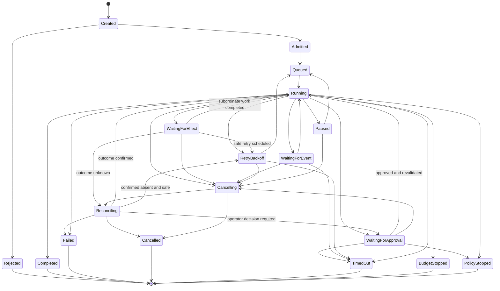

# Runtime and kernel

> **Status: Normative for ARA Durable and higher profiles**

## Canonical components

```text
Execution Kernel
+ Runtime Service
+ DurableExecutionPort and adapter
+ ExecutionCommitPort
+ State Store and projections
+ Platform Run Journal
+ Effect Ledger
+ Scheduler
+ Runtime Workers and WorkerLeases
+ Policy/Budget/Approval Gate
+ Model, Tool, Memory, Artifact, Human, External-Agent, and Sandbox Gateways
```

## Ownership

| Component | Owns | MUST NOT own |
|---|---|---|
| **Execution Kernel** | Pure legal state evolution, dependency resolution, completion, execution intents | Workers, SDKs, queues, clocks, secrets, provider clients |
| **Runtime Service** | Admission, coordination, scheduling, cancellation, streaming, recovery | Business-domain truth or authoring lifecycle |
| **Scheduler** | Runnable-work ordering, capacity, fairness, placement | Workflow semantics |
| **Runtime Worker** | Bounded execution of assigned activities/effects | Authoritative in-memory state |
| **WorkerLease** | Temporary ownership and fencing | Logical retry semantics |
| **Durable execution adapter** | Timers, signals, suspension, backend recovery | Public ARA semantic model |
| **ExecutionCommitPort** | One atomic authoritative execution transition | Provider calls or business-domain decisions |
| **Platform Run Journal** | Canonical portable execution facts and stable public run semantics | Token-level streams and provider internals |
| **Effect Ledger** | Effect identity, invocations, idempotency, ambiguous outcomes, reconciliation | Business completion decisions |

The canonical journal is platform-owned. An application supplies domain events through contracts but does not own the platform execution schema.

## Execution kernel contract

```typescript
interface ExecutionKernel {
  evolve(state: RunState, event: RunEvent): RunState;
  decide(
    state: RunState,
    workflow: WorkflowVersion,
    deployment: DeploymentSnapshot
  ): readonly ExecutionIntent[];
}
```

For a fixed state, workflow version, deployment snapshot, and event sequence, `evolve` **MUST** return the same state.

`ExecutionIntent` may request activity scheduling, a semantic effect, a wait, child execution, completion, or failure. It is not a provider call and does not itself mutate authoritative state.

## Atomic transition commit

All authoritative writes for one accepted transition **MUST** use one consistency boundary or an equivalent protocol with the same safety properties:

```typescript
interface ExecutionCommitContext {
  tenant: TenantScope;
  actor: ActorIdentity;
  runId: RunId;
  expectedStateVersion: number;
  expectedRunSequence: number;
  workerLeaseId?: WorkerLeaseId;
  fencingToken?: bigint;
  correlationId: string;
}

interface TransitionCommit {
  events: readonly NewRunEvent[];
  nextState: RunState;
  effectMutations: readonly EffectMutation[];
  invocationMutations: readonly InvocationMutation[];
  approvalMutations: readonly ApprovalMutation[];
  budgetMutations: readonly BudgetMutation[];
  outboxEvents: readonly IntegrationEvent[];
}

interface ExecutionCommitPort {
  commit(
    ctx: ExecutionCommitContext,
    transition: TransitionCommit
  ): Promise<Result<CommitReceipt, CommitError>>;
}
```

A conforming commit implementation **MUST**:

1. Verify the expected state version and run sequence.
2. Verify the current fencing token when a worker owns the transition.
3. Append canonical events.
4. Update the current-state projection.
5. Update effect, invocation, approval, and budget ledgers.
6. Insert integration outbox records.
7. Commit or reject the complete unit atomically.

A runtime **MUST NOT** acknowledge a transition before this commit is durable.

## Durable execution boundary

```typescript
interface DurableExecutionPort {
  start(ctx: ExecutionContext, runId: RunId, deployment: DeploymentSnapshotRef): Promise<Result<DurableExecutionRef>>;
  signal(ctx: ExecutionContext, execution: DurableExecutionRef, signal: RuntimeSignal, idempotencyKey: string): Promise<Result<void>>;
  cancel(ctx: ExecutionContext, execution: DurableExecutionRef, reason: string): Promise<Result<void>>;
  query(ctx: ExecutionContext, execution: DurableExecutionRef): Promise<Result<DurableExecutionStatus>>;
}
```

Adapters may use Temporal, a database scheduler, an actor/event-sourced backend, or another durable mechanism. Backend-native history does not replace the platform journal.

## Dual-history contract

A durable-engine adapter maintains three related but distinct records:

```text
Durable backend history
    operational source used by the backend for replay and recovery

Platform Run Journal
    portable semantic source for ARA execution events

Effect Ledger
    source for logical effect identity and external outcomes
```

The adapter profile **MUST** define:

- Stable correlation between backend execution and ARA run IDs.
- Which backend transition projects each canonical event.
- Idempotent journal projection and duplicate handling.
- Behavior when backend history advances but semantic projection is delayed.
- Rebuild and reconciliation procedures.
- Schema and runtime migration rules.
- History rollover/continue-as-new behavior where applicable.
- How backend worker ownership satisfies or implements `WorkerLease` fencing.

See [Durable backend profile](/reference/durable-backend-profile).

## Lifecycle separation

The run status shown to users is a projection over separate authoritative lifecycles:

```text
Run
ActivityRun
ActivityAttempt
Effect
Invocation
Approval
WorkerLease
ChildRunLink
EvaluationRun
```

An implementation **MUST NOT** use one overloaded enum as the sole source of truth for all of these lifecycles. See [Lifecycle contracts](/reference/lifecycles).

## Run state projection



This state machine is a run-level projection. More detailed states remain in subordinate records.

## Effect lifecycle

```text
proposed
-> schema and semantic validation
-> policy/capability decision
-> budget reservation
-> approval when required
-> effect.planned committed
-> zero or more invocations
-> effect result, denial, failure, cancellation, or unknown outcome
-> usage reconciliation
-> state evolution
```

An effect **MUST** be durably planned before its first invocation.

## Retry and reconciliation

| Failure scope | Canonical response |
|---|---|
| One provider call fails safely | New `Invocation` for the same `Effect` |
| Provider requests backoff | Durable capacity wait, then new `Invocation` |
| Poll/status/reconciliation query | New `Invocation` for the same `Effect` |
| Prompt/context/arguments/tool/authority changes | New `Effect` |
| Complete activity restarts | New `ActivityAttempt`; reuse prior completed effects |
| Worker dies but state is resumable | New `WorkerLease`, same logical execution |
| Outcome may have occurred | Reconcile before any mutating retry |
| New intentional cycle | New `Iteration` |
| Independent experiment replicate | New `ExperimentTrial` referencing a new execution subject |

`retryable`, `safeToRetry`, and `effectMayHaveOccurred` are separate error properties.

## Idempotency

A stable semantic effect key SHOULD include:

```text
activityRunId / semanticEffectSlot / normalizedInputDigest / authorityScopeDigest
```

The key remains stable across activity attempts and invocations when semantic intent is unchanged. It **MUST NOT** contain a random invocation ID or activity-attempt ordinal.

## Concurrency

One authoritative state-transition writer exists per run. Independent effects, activities, or branches may execute concurrently when:

- No dependency edge prevents it.
- Policy and budget allow it.
- Downstream capacity permits it.
- Results can be deterministically joined.
- Shared authoritative state is not mutated concurrently.
- Every execution instance has a stable `ActivityRunId` and scope identity.

Logical parallelism does not imply immediate physical dispatch. The Scheduler enforces provider, tenant, region, budget, and worker capacity.

## Credentials

The Runtime Service and Execution Kernel **MUST NOT** receive plaintext long-lived credentials. A credential broker resolves a secret purpose or credential profile into a short-lived provider credential at the adapter dispatch boundary. Credentials MUST NOT enter prompts, run state, journals, artifacts, logs, or telemetry.

## Resume, replay, and rerun

| Mode | Purpose | Identity |
|---|---|---|
| Operational resume | Continue unfinished work without repeating completed effects | Same run |
| Evidence replay | Reconstruct deterministic state with recorded effect outcomes and no external dispatch | Same historical run/evidence view |
| Counterfactual rerun | Start new execution using selected historical inputs and new versions/routes | New run |

Checkpoints optimize resume. They are not the canonical journal or audit ledger.

## Cancellation

Cancellation prevents new effects, propagates to cancellable children and invocations, and reconciles ambiguous mutations. It does not erase completed effects. A cancellation request is idempotent and does not imply that an external operation was successfully cancelled without provider evidence.

## Default recommendation

Critical long-running systems SHOULD use a Temporal-class durable backend behind `DurableExecutionPort`, a transactional relational/distributed SQL boundary for execution commits and projections, immutable object storage for artifacts and protected payloads, and separate gateways for models, tools, policy, credential injection, external agents, and sandboxes.